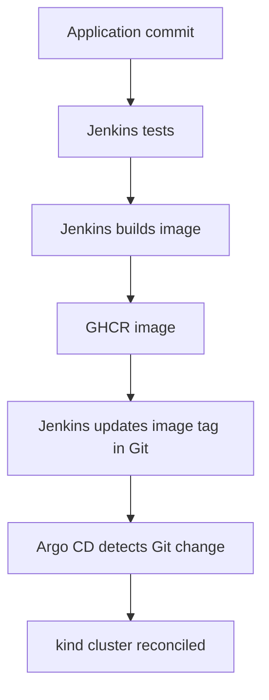

# AI Platform SRE Lab: Jenkins + Argo CD + GitOps

A zero-cloud-cost learning environment that deploys
[`goshipra/rag-mlops-pipeline`](https://github.com/goshipra/rag-mlops-pipeline)
and Qdrant to a local Kubernetes cluster.

The central design rule is simple:

- **Jenkins performs CI:** test, build, publish, and update the declared image tag in Git.
- **Argo CD performs CD:** detect the Git change and reconcile Kubernetes.
- **GitOps is the operating model:** this repository is the source of truth for the cluster.

Jenkins intentionally has no Kubernetes credentials. Argo CD intentionally does not build
application code.

## Delivery flow



## Repository layout

```text
apps/rag/base/             Reusable RAG and Qdrant Kubernetes resources
apps/rag/overlays/local/   Local desired state; Jenkins changes only the image tag
kind/cluster.yaml          Local kind cluster and host port mapping
platform/argocd/           Argo CD Application declaration
jenkins/                   Reproducible Jenkins controller container
scripts/                   Bootstrap, verification, UI, and cleanup helpers
Jenkinsfile                CI pipeline
```

## Prerequisites

- Docker Desktop
- `kind`
- `kubectl`
- Git
- A GitHub personal access token that can push packages and repository contents

On Apple Silicon, allocate at least 8 GB of memory to Docker Desktop because the Python
image includes ML dependencies.

## Phase 1: run Jenkins CI

The first application image must exist before Argo CD can make the application healthy.
Start Jenkins:

```bash
docker compose -f jenkins/compose.yaml up -d --build
docker logs ai-platform-jenkins
```

Open <http://localhost:8081>. Obtain the initial password with:

```bash
docker exec ai-platform-jenkins \
  cat /var/jenkins_home/secrets/initialAdminPassword
```

Complete the setup wizard and create two **Username with password** credentials:

| Credential ID | Username | Password/token permissions |
|---|---|---|
| `ghcr-credentials` | GitHub username | GitHub token with package write access |
| `github-credentials` | GitHub username | GitHub token with repository content write access |

Create a **Pipeline** job:

1. Choose **Pipeline script from SCM**.
2. Select **Git**.
3. Use `https://github.com/goshipra/ai-platform-sre-lab.git`.
4. Set branch to `*/main`.
5. Keep script path as `Jenkinsfile`.
6. Save and select **Build Now**.

The first successful run replaces `newTag: bootstrap` with the application commit SHA.
That Git commit is the deployment request. In GitHub, open the newly created
`rag-mlops-pipeline` package settings and change its visibility to **Public** so the local
cluster can pull it without storing registry credentials.

## Phase 2: bootstrap Argo CD and Kubernetes

```bash
./scripts/bootstrap.sh
./scripts/verify.sh
```

Open the service at <http://localhost:8080/healthz>.

To inspect Argo CD:

```bash
./scripts/argocd-ui.sh
```

Open <https://localhost:8443>. The script prints the initial admin password and keeps the
port-forward open.

Useful observation commands:

```bash
kubectl get applications -n argocd
kubectl get pods -n rag-platform
kubectl describe application rag-platform -n argocd
kubectl get events -n rag-platform --sort-by=.lastTimestamp
```

## Prove the separation of responsibilities

### Test drift correction

```bash
kubectl scale deployment/rag-service -n rag-platform --replicas=3
kubectl get deployment/rag-service -n rag-platform --watch
```

Argo CD self-healing returns it to one replica because Git declares one replica.

### Test a GitOps rollback

```bash
git log --oneline -- apps/rag/overlays/local/kustomization.yaml
git revert <deployment-commit>
git push
```

Argo CD detects the reverted image tag and rolls Kubernetes back. Jenkins does not run
`kubectl`, and no manual cluster deployment is needed.

## Security choices included

- Dedicated service accounts with API-token mounting disabled
- Dropped Linux capabilities and privilege escalation disabled
- Default-deny NetworkPolicy with explicit RAG-to-Qdrant traffic
- Readiness and liveness probes
- CPU and memory requests/limits
- Pinned Qdrant and Argo CD versions
- Jenkins credentials injected only during the stages that need them
- Immutable application image tags based on Git commit SHA

## Teardown

```bash
./scripts/destroy.sh
docker compose -f jenkins/compose.yaml down
```

Add `-v` only when you intentionally want to erase Jenkins state and credentials.

## Next milestones

After this delivery path is healthy, extend the lab with Prometheus/Grafana, one
availability SLO, an actionable alert, a controlled Qdrant failure, a runbook, and a short
postmortem. This keeps the first lesson focused on Jenkins versus Argo CD versus GitOps.
